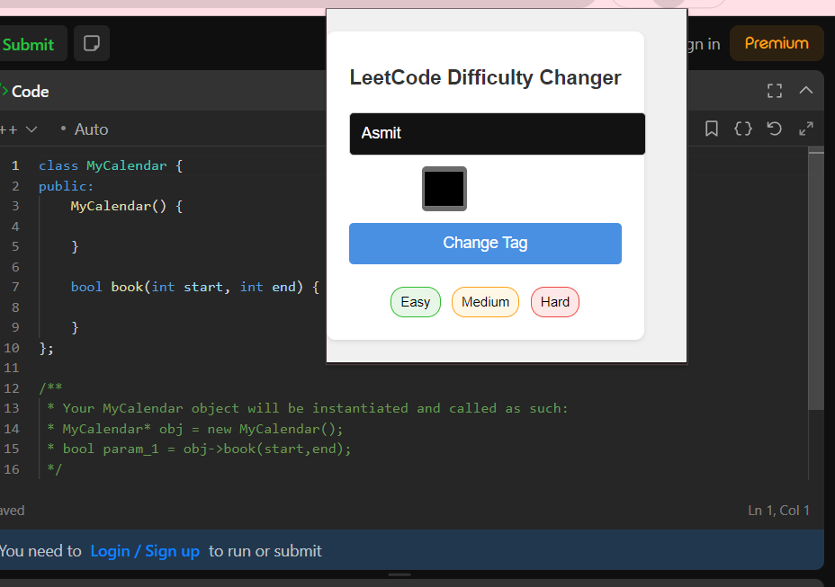
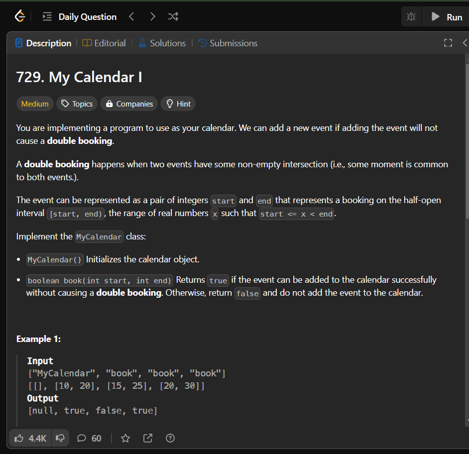
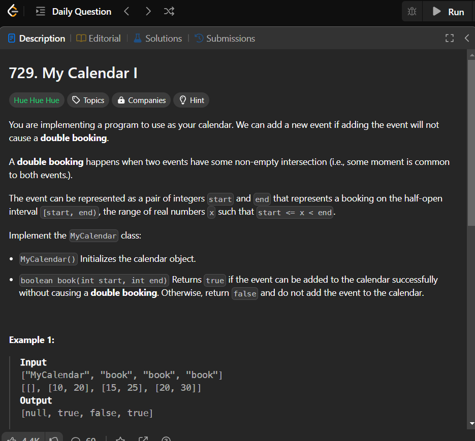

# LeetCode Difficulty Changer

A Chrome extension that allows you to customize the difficulty tags on LeetCode problems.

<!--  -->

## Features

- Change the text of difficulty tags (Easy, Medium, Hard) to any custom text
- Customize the color of the difficulty tags
- Changes apply instantly across the LeetCode website
- User-friendly popup interface

## Installation

1. Clone this repository or download the ZIP file.
2. Open Chrome and navigate to `chrome://extensions`.
3. Enable "Developer mode" in the top right corner.
4. Click "Load unpacked" and select the directory containing the extension files.

## Usage

1. Navigate to [LeetCode](https://leetcode.com).
2. Click on the extension icon in your browser toolbar.
3. Enter your desired custom text for the difficulty tags.
4. Choose a color for the tags using the color picker.
5. Click "Change Tag" to apply your changes.

## Screenshots

### Extension Popup

### Before and After

## Development

To modify or enhance this extension:

1. Make changes to the source files.
2. Reload the extension in `chrome://extensions`.
3. Refresh the LeetCode page to see your changes.

## Contributing

Contributions are welcome! Please feel free to submit a Pull Request.
